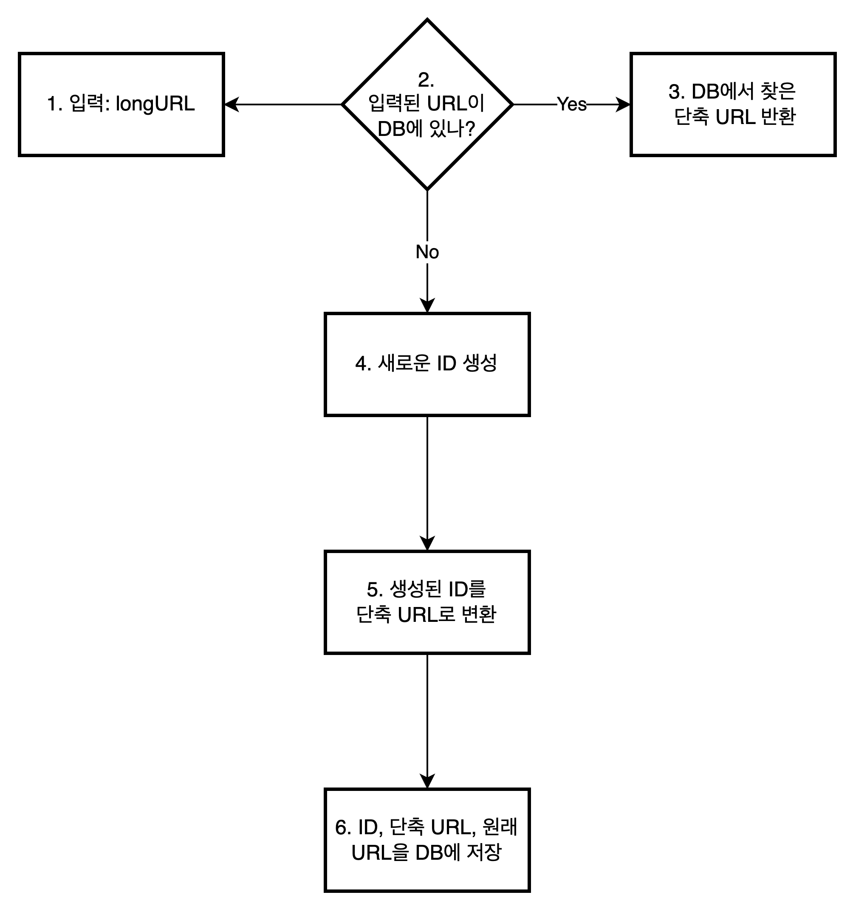

# URL-Shortener

## 1단계 문제 이해 및 설계 범위 확정

### 시스템의 기본적 기능

1. URL 단축: 주어진 긴 URL을 훨씬 짧게 줄인다.
2. URL 리디렉션(redirection): 축약된 URL로 HTTP 요청이 오면 원래 URL로 안내
3. 높은 가용성과 규모 확장성, 그리고 장애 감내가 요구됨

### 개략적 추정

- 쓰기 연산: 매일 1억 개의 단축 URL 생성
- 초당 쓰기 연산: 1억(100 million)/24/3600 ≓ 1160회
- 읽기 연산: 읽기 연산과 쓰기 연산 비율은 10:1이라고 가정. 읽기 연산은 초당 11,600(1160 * 10)회
- URL 단축 서비스를 10년간 운영한다고 가정하면, 총 단축 URL 수는 1억 * 365 * 10 = 3650억(365 billion)개의 레코드를 보관해야 한다.
- 축약 전 URL의 평균 길이는 100이라고 하자.
- 10년 동안 필요한 저장 용량은 3650억 * 100 = 3650억 * 100Byte = 3650GB = 3.65TB

## 2단계 개략적 설계안 제시 및 동의 구하기

### API 엔드포인트

**URL 단축용 엔드포인트**: 새 단축 URL을 생성하고자 하는 클라이언트는 이 엔드포인트에 단축할 URL을 인자로 실어서 POST 요청을 보낸다.

요청

```http request
POST /api/v1/data/shorten HTTP/1.1
Content-Type: application/json

{
  "longUrl": "longURLstring"
}
```

응답

```http request
HTTP/1.1 200 OK
Content-Type: application/json


{
  "shortUrl": "shortenedURL"
}
```

**URL 리디렉션용 엔드포인트**: 단축 URL에 대해서 HTTP 요청이 오면 원래 URL로 보내주기 위한 용도의 엔드포인트

요청

```http request
GET /api/v1/shortUrl HTTP/1.1
```

응답

```http request
HTTP/1.1 301 Moved Permanently
Location: longURLstring

# 또는

HTTP/1.1 302 Found
Location: longURLstring
```

### URL 리디렉션

단축 URL을 받은 서버는 그 URL을 원래 URL로 바꿔서 301 또는 302 응답의 Location 헤더에 넣어 반환한다.

> 301 Moved Permanently: 요청한 리소스가 새 위치로 옮겨졌으며, 이후로는 요청에 대한 새로운 주소가 사용되어야 함을 나타냄. 브라우저는 이 응답을 캐시(cache)하고 재사용한다.
> 302 Found: 요청한 리소스가 일시적으로 다른 위치에 있음을 나타냄. 이 응답은 리소스가 영구적으로 이동된 경우에도 사용할 수 있다. 브라우저는 이 응답을 캐시하지 않는다.

301을 사용하게 되면 서버의 부하를 줄일 수 있고, 302를 사용하게 되면 트래픽 분석(analytics)을 할 수 있다.

URL 리디렉션을 가장 직관적인 방법은 해시 테이블을 사용할 수 있다. <단축 URL, 원래 URL> 쌍을 저장하도록 한다.

- 원래 URL = hashTable.get(단축 URL)
- 301 또는 302 응답 Location 헤더에 원래 URL을 넣어 반환

### URL 단축

긴 URL을 해시 값으로 대응할 수 있는 해시 함수(hash function)는 다음과 같은 요구사항을 만족해야 한다.

- 입력으로 주어지는 긴 URL이 다른 값이면 해시 값도 달라야 한다.
- 계산된 해시 값은 원래 입력으로 주어졌던 긴 URL로 복원될 수 있어야 한다.

## 3단계 상세 설계

데이터 모델, 해시 함수, URL 단축 및 리디렉션에 대한 구체적인 설계안

### 데이터 모델

해시 테이블을 이용한다고 했던 기존의 전략을 RDBMS를 이용한 전략으로 변경한다.

### 해시 함수

해시 함수는 원래 URL을 단축 URL로 변환하는데 쓰인다. 편의상 단축 URL을 hashValue로 지칭한다.

- 해시 값 길이

해시 값은 [0-9, a-z, A-Z]의 문자들로 구성된다. 10 + 26 + 26 = 62개의 문자로 구성된다.

hashValue의 길이를 정하기 위해서는 62^n >= 3650억(365 billion)을 만족하는 최소의 n을 구하면 된다.

n = 7 부터 충분히 만족시킬 수 있다.

해시 함수 구현에 쓰이는 기술은 1. 해시 후 충돌 해소, 2. base-62 변환이 있다.

- 해시 후 충돌 해소

다양한 해시 함수를 사용하더라도, 7자 보다 길어지게 된다. 계산 된 해시 값에서 처음 7개 글자만 사용하게 되면, 해시 결과가 서로 충돌할 확률이 높아진다.

충돌이 발생할 경우, 해소될 때까지 지정한 문자열을 해시값에 추가하는 방법을 사용한다.

하지만 이 방법은, URL을 생성할 때 마다 데이터베이스에 접근해야하므로 오버헤드가 크다.

블룸 필터를 사용하는 방법을 통해 성능을 올릴 수 있다.

- base-62 변환

수의 표현 방식이 다른 두 시스템이 같은 수를 공유하고자 할때 유용하다.

62진법을 사용하는 이유는 hashValue에 사용할 수 있는 문자(characters)가 62개이기 때문이다.

변환 방법은 다른 진법과 동일하다.

### URL 단축기 상세 설계

URL 단축기는 시스템의 핵심 컴포넌트이다.



ID 생성기의 주된 용도는 단축 URL을 만들 때 사용할 ID를 만드는 것이고, 이 ID는 전역적 유일성(globally unique)이 보장되어야 한다.

### URL 리디렉션 상세 설계

로드 밸런서, 캐시 등을 이용하여 성능을 향상시킬 수 있다.
